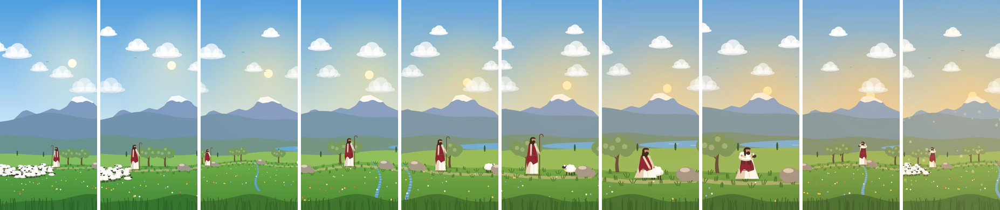

# The Lost Sheep

A calm, local-first Android focus timer inspired by Matthew 18:12–13. Each focus session is a short
visual story: the Good Shepherd notices one sheep missing, searches the hills, finds it, and carries
it home, moving forward only as you stay focused.



## What's in this MVP

- **Focus home**: small illustration, large timer, 15 / 25 / 45 / 60 / Custom (1 to 180 minutes), an optional
  "What will you focus on?" line, Begin Focus, "🔥 4 day streak", "Today: 1h 25m" and today's goal (2/4).
- **Focus session**: the story fills the whole screen. A small floating timer sits on top, with one ⏸ button;
  navigation is hidden. Captions ("One is missing.", "Keep going.", "You are not forgotten.") fade in and out,
  and the final minute gets a thin gold countdown line. Every few minutes a Bible verse fades in over the
  lower part of the scene and fades out again; it is chosen from focused time, so a paused session keeps the same verse.
- **Story synced to progress**: the scene is a pure function of session progress (`LostSheepChoreography`),
  with 720 named search frames across ten terrains, then the Found and Return beats. Pausing at 63% and
  resuming shows the 63% frame. Nothing restarts.
- **Optional AI video**: drop one clip per stage into `app/src/main/assets/stories/lost-sheep/`
  (see [docs/video-clips.md](docs/video-clips.md)) and the app steps through them in time with the session
  instead of drawing the scene. Without all the clips it uses the drawn scene.
- **Pause / Resume / End**: pause freezes timer, scene and sound (apps stay blocked); End asks for
  confirmation and saves the session as ended early, with the focused time.
- **Completion**: the scene finishes, then "The lost sheep is found.", "Well done. You stayed focused.",
  a short closing prayer or verse, and a small sheet: minutes focused, Session completed ✓, "Did you finish it?"
  for the intention, an optional journal note, Start Another Session / Take a Break.
- **App blocking**: pick apps (suggested distractions and "All games" shortcut). During a session an
  Accessibility service shows "The flock can wait." with the time remaining and Return to Focus.
  Usage Access works as a lighter fallback.
- **My Journey**: a small landscape that grows with completed sessions (hill → trees at 5 → wider at 10 →
  valley at 20, one sheep per session), Today's Reflection ("Every focused moment is a step toward what matters."), and session history with each
  session's intention and journal note.
- **Stats**: today's focus, sessions against the daily goal, streak, distractions blocked, intentions finished, last-7-days bars.
- **Three stories**: The Lost Sheep, David & Goliath (five smooth stones, one sling, the giant falls) and
  Noah's Ark (built plank by plank, two by two, the rain, the dove, the rainbow). Pick one from Home or Settings.
- **Daily reminder**: an optional notification at a chosen time with a verse, skipped on days you already focused.
- **Scheduled focus**: sessions that start by themselves at set times on chosen days, with app blocking.
- **Home-screen widget**: today's sessions against the goal, the streak, and a Begin Focus button.
- **Settings**: durations, daily goal, blocked apps, permissions (with plain-language explanations),
  sound, timer notification, scheduled focus, daily reminder, verses while focusing, closing prayer or verse,
  Journey verse, privacy.
- **Sound** (optional): wind, a soft pad, occasional birds and a distant sheep, plus a gentle completion
  chime, all synthesized on the device. No audio files, no network.
- Dark mode, landscape layout, TalkBack descriptions, and the system "remove animations" setting respected.

## Session recovery (sections 15–28 of the brief)

The timer never counts down in memory. `ActiveSession` stores banked time plus the start of the
current running segment on Android's monotonic clock (`elapsedRealtime`, which keeps ticking while the
phone sleeps and ignores manual clock changes). Remaining time is always `planned - elapsed`.

| Situation | What happens |
|---|---|
| Screen locked / app in background | Foreground service + notification keep the session alive; the time is recomputed on return (lock at 22:15, unlock 8 min later → 14:15). |
| Paused, then locked for hours | Paused time is never counted (18:30 stays 18:30 until Resume). |
| App swiped away / process killed | Every change is written synchronously to local storage before it's shown. On relaunch: "Your focus session is still active." with the shepherd at the right point in the journey. |
| Time ran out while closed | An alarm completes it on time when possible; otherwise the next launch shows the completion screen, never a restarted timer. |
| Phone restart | Boot receiver restores the session; across a reboot the wall clock bridges the gap once, then it re-anchors to the monotonic clock. |
| System time changed | No effect within a boot (monotonic clock). |
| Rotation | State lives outside the UI; the scene is driven by elapsed time, so it doesn't jump. |
| Blocking permission revoked mid-session | Timer continues; a notification and an in-session note explain how to restore blocking. |
| Starting a second session | Refused; only one active session can exist. |

Unit tests in `app/src/test` cover these timing cases, story phases, scene continuity and stats.

## Build

Requirements: Android Studio (Ladybug or newer) or the Android SDK with platform 35, JDK 17.

```bash
./gradlew assembleDebug          # app/build/outputs/apk/debug/app-debug.apk
./gradlew testDebugUnitTest      # unit tests
```

If `./gradlew` isn't executable after unzipping, run `chmod +x gradlew` first. Opening the folder in
Android Studio also works; it will create `local.properties` with your SDK path.

`.github/workflows/android.yml` builds the debug APK and runs the tests on GitHub Actions if you push
this folder to a repository.

## Permissions, and why

| Permission | Why |
|---|---|
| Accessibility service | Notices which app comes to the front during a session you started, so a blocked app shows "The flock can wait." It does not read screen content. |
| Usage Access (optional) | Fallback detection of a blocked app if Accessibility is off. Android may not allow a screen to open from the background, so it also posts a gentle notification. |
| Notifications | Optional ongoing timer with Pause / Resume / End, and the completion message. |
| Foreground service (special use) | Keeps the timer, blocking checks and sound alive while the screen is off. |
| Boot completed | Restores an active session after a restart, and re-arms the reminder and scheduled sessions. |
| Alarms & reminders (optional) | Lets a scheduled session start exactly on the minute. Without it, it starts within a minute or so. |

No internet permission is requested. Nothing is backed up off the device.

## Architecture

```
com.lostsheep.focus
├── LostSheepApp            hand-wired AppContainer (Room DB, settings, clock, SessionManager)
├── MainActivity            Compose host; recovery dialog / notification intents
├── session/                ActiveSession (timestamp math, JSON), SessionManager (single source of truth),
│                           FocusTimerService, notifications, alarm + boot receivers, AmbientSound
├── blocking/               BlockerAccessibilityService, BlockedActivity, AppCatalog, permissions
├── story/                  FocusStory interface + registry, LostSheepChoreography (pure), LostSheepStory (Canvas), StoryVideo, Verses
├── data/                   Room entities/DAOs, SettingsStore, FocusStatsCalculator
└── ui/                     theme, components, focus / journey / stats / settings screens, FocusViewModel
```

### Adding a new story

Implement `FocusStory` (phases with captions and descriptions, plus a `Scene` composable that draws from
`progress`, `time` and `celebration`), then add it to `Stories.all`. David & Goliath, Noah, Daniel and
Jesus in the Wilderness are listed as coming soon in Settings.

## Known limits of this MVP

- On Android 10+ the Usage Access fallback can't always bring the blocked screen to the front; Accessibility is the reliable path.
- The completion alarm is inexact under Doze (it avoids the exact-alarm permission); the app still shows completion the moment it is opened.
- Scene animation is capped at ~30 fps to save battery; the motion is slow enough that it looks the same.
- Verse texts other than Matthew 18:12–13 use the public-domain World English Bible.
